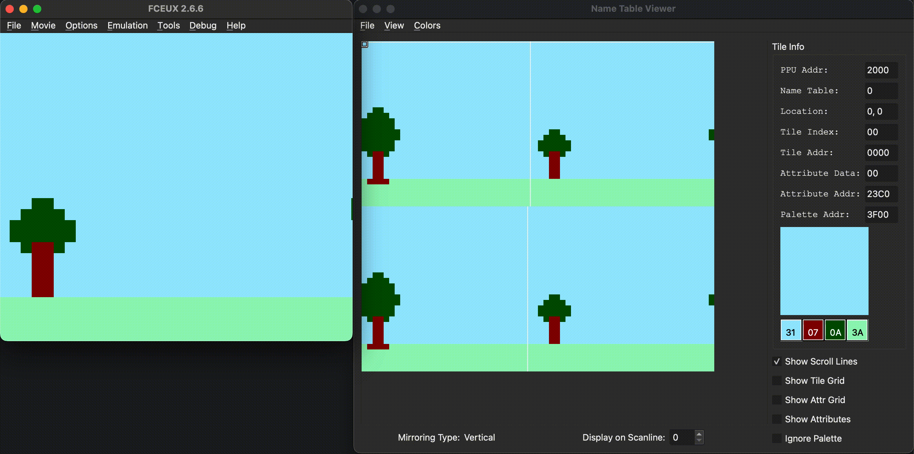
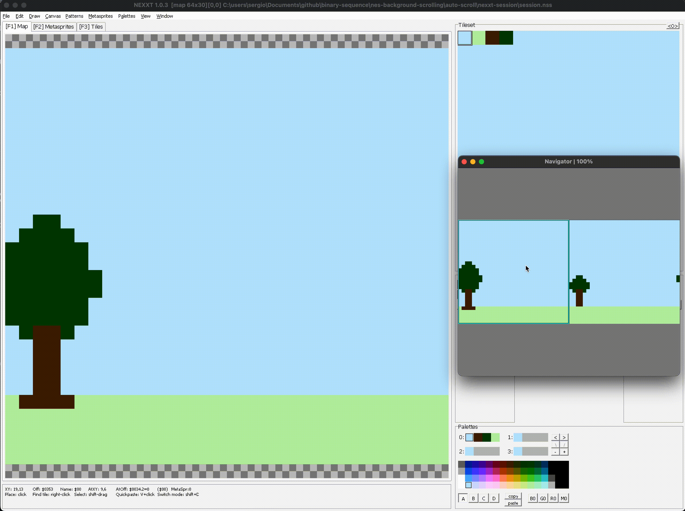

# nes-background-scrolling
Examples of background scrolling in [NES 6502 assembler](https://www.masswerk.at/6502/6502_instruction_set.html) for [ca65/ld65](https://cc65.github.io/doc/)

Nice! You already know how draw static backgrounds for NES. (See https://github.com/binary-sequence/nes-hello-world)

Now it is time for the next level: background scrolling.

1. [auto-scroll-horizontal.nes](#auto-scroll-horizontalnes)
2. [Special thanks to](#special-thanks-to)

# auto-scroll-horizontal.nes

Color palettes, pattern tables and even two nametables were created with the [NEXXT](https://frankengraphics.itch.io/nexxt) tile editor.

- See the source code [auto-scroll.asm](auto-scroll-horizontal/src/auto-scroll-horizontal.asm)

# Special thanks to
- https://www.youtube.com/@NesHacker
- https://www.youtube.com/@DisplacedGamers
- https://famicom.party
- https://www.nesdev.org/wiki/Nesdev_Wiki
  - https://discord.gg/JSG4kuF8EK (including people in the discord channel)
